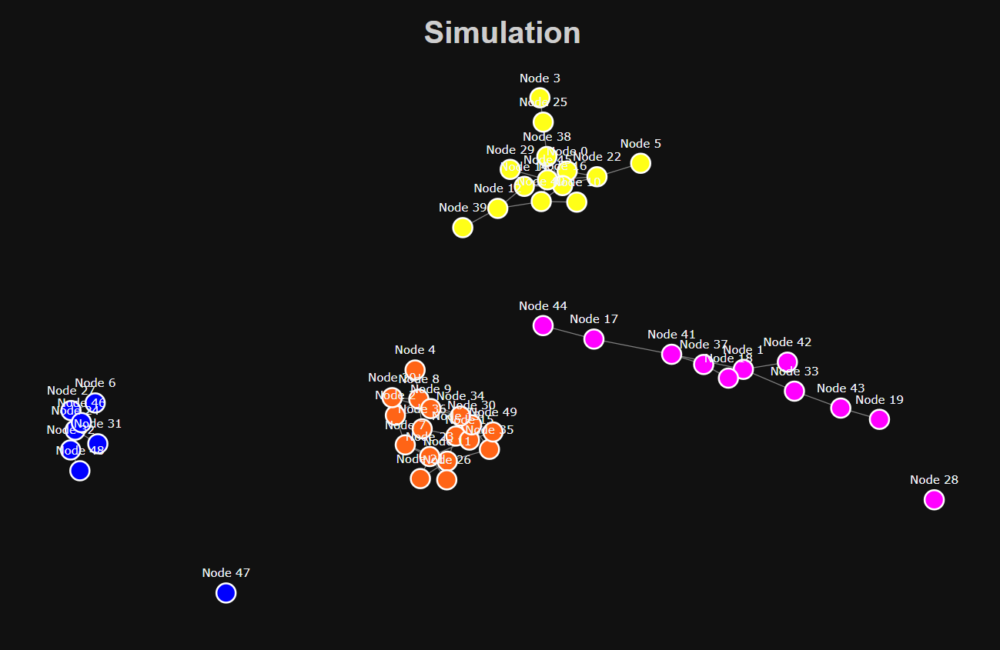

# Results

This markdown document is a summary of the different results from common games and ones that show interesting patterns.

All Simulations use default parameters unless stated or shown otherwise.

## The Prisoners Dilemma

As expected in a typical Prisoner's Dilemma, the defect strategy (orange) dominates.

### Now lets try only allowing changes in connections (set S/C Ratio to 0)

When only connections are allowed to be changed, all the defectors are effectively exiled because all players choose to remove them from their connections.

## Coordination Games

Only allowing connection changes:

50/50 Split:

Only Strategy Changes:

I particularly found the only strategy changes, and only connection changes simulations interesting as they show how different levels of interaction control can drastically change the outcome. When strategy must remain the same, groups will segregate themselves, but when you can only change your strategy and not your neighbors, then the group will unify to the most effective strategy.

## Hawk-Dove

Hawks were exiled from the group in this simulation. This is partly due to the simulation design making it difficult for those who were exiled to re-enter, but still interesting to simulate.

